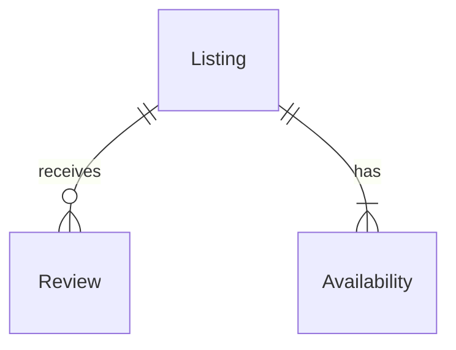

# [Bed and Breakfast](https://cs50.harvard.edu/sql/2024/psets/4/bnb/)

 “A bed and breakfast in Boston, the style of a realistic photograph”, generated by DALL·E 2

## Problème à résoudre

Un Bed and Breakfast (“BnB” en abrégé !) est un lieu d'hébergement à court terme où l'on peut séjourner et payer le propriétaire pour le service, similaire à un hôtel. Au cours des dernières années, AirBnB a permis à presque tout le monde de louer son logement, qu'il s'agisse d'une maison, d'un cottage mignon ou même d'une cabane dans les arbres.

Vous êtes un analyste de données pour la ville de Boston et vous vous intéressez à découvrir comment l'essor d'AirBnB a changé la scène touristique locale. Vous avez même compilé une base de données, `bnb.db`, remplie de données directement issues d'AirBnB. Dans `bnb.db`, créez quelques vues (views) qui donneront une image plus claire de l'influence d'AirBnB sur la ville de Boston.

## Démonstration

```sqlite
$ sqlite3 bnb.db                                                                                    
sqlite> SELECT "property_type", "host_name", "bedrooms"                                             
   ...> FROM "listings"                                                                             
   ...> LIMIT 10;
.quit
```

## Code de distribution

Pour ce problème, vous devrez télécharger `bnb.db`, ainsi que quelques fichiers `.sql` dans lesquels vous écrirez vos requêtes (queries).

## Schéma



Dans `bnb.db`, vous trouverez trois tables qui implémentent les relations décrites dans le diagramme ER ci-dessus. Cliquez sur les déroulants ci-dessous pour en savoir plus sur le schéma de chaque table.

`listings` table

La table `listings` contient les colonnes suivantes :

- `id`, qui est l'ID de l'annonce (listing).
- `property_type`, qui est le type de l'annonce (par exemple, “Entire rental unit”, “Private room in rental unit”, etc.).
- `host_name`, qui est le nom d'utilisateur AirBnB de l'hôte de l'annonce.
- `accommodates`, qui est le nombre maximum d'occupants de l'annonce.
- `bedrooms`, qui est le nombre de chambres de l'annonce.
- `description`, qui est la description de l'annonce sur AirBnB.

`reviews` table

La table `reviews` contient les colonnes suivantes :

- `id`, qui est l'ID de l'avis (review).
- `listing_id`, qui est l'ID de l'annonce qui a reçu l'avis.
- `date`, qui est la date de publication de l'avis.
- `reviewer_name`, qui est le nom d'utilisateur AirBnB du réviseur.
- `comments`, qui est le contenu de l'avis.

`availabilities` table

La table `availabilities` contient les colonnes suivantes :

- `id`, qui est l'ID de la disponibilité (availability).
- `listing_id`, qui est l'ID de l'annonce associée à la disponibilité.
- `date`, qui est la date de la disponibilité.
- `available`, qui indique si la date est toujours disponible à la réservation (`TRUE` ou `FALSE`).
- `price`, qui est le prix du séjour à la date donnée.

## Spécification

Dans chacun des fichiers `.sql` correspondants, écrivez une instruction SQL (SQL statement) pour créer chacune des vues (views) suivantes des données dans `bnb.db`. Notez que, bien que les vues puissent être créées à partir d'autres vues, chacune de vos vues doit être autonome (c'est-à-dire ne pas dépendre d'une vue antérieure).

#### No Descriptions

Vous remarquerez peut-être qu'en exécutant

```
SELECT * FROM "listings" LIMIT 5;
```

les résultats semblent assez bizarres ! La colonne `description` contient des descriptions avec de nombreux sauts de ligne, chacun étant imprimé dans votre terminal.

Dans `no_descriptions.sql`, écrivez une instruction SQL pour créer une vue nommée `no_descriptions` qui inclut toutes les colonnes de la table `listings` sauf `description`.

#### One-Bedrooms

Dans `one_bedrooms.sql`, écrivez une instruction SQL pour créer une vue nommée `one_bedrooms`. Cette vue doit contenir toutes les annonces (listings) qui ont exactement une chambre. Assurez-vous que la vue contient les colonnes suivantes :

- `id`, qui est l'`id` de l'annonce de la table `listings`.
- `property_type`, de la table `listings`.
- `host_name`, de la table `listings`.
- `accommodates`, de la table `listings`.

#### Available

Dans `available.sql`, écrivez une instruction SQL pour créer une vue nommée `available`. Cette vue doit contenir toutes les dates disponibles pour toutes les annonces. Assurez-vous que la vue contient les colonnes suivantes :

- `id`, qui est l'`id` de l'annonce de la table `listings`.
- `property_type`, de la table `listings`.
- `host_name`, de la table `listings`.
- `date`, de la table `availabilities`, qui est la date de la disponibilité.

#### Frequently Reviewed

Dans `frequently_reviewed.sql`, écrivez une instruction SQL pour créer une vue nommée `frequently_reviewed`. Cette vue doit contenir les 100 annonces les plus fréquemment commentées, triées de la plus à la moins fréquemment commentée. Assurez-vous que la vue contient les colonnes suivantes :

- `id`, qui est l'`id` de l'annonce de la table `listings`.
- `property_type`, de la table `listings`.
- `host_name`, de la table `listings`.
- `reviews`, qui est le nombre d'avis que l'annonce a reçus.

Si deux annonces ont le même nombre d'avis, triez par `property_type` (par ordre alphabétique), puis par `host_name` (par ordre alphabétique).

#### June Vacancies

Dans `june_vacancies.sql`, écrivez une instruction SQL pour créer une vue nommée `june_vacancies`. Cette vue doit contenir toutes les annonces et le nombre de jours en juin 2023 où elles sont restées vacantes. Assurez-vous que la vue contient les colonnes suivantes :

- `id`, qui est l'`id` de l'annonce de la table `listings`.
- `property_type`, de la table `listings`.
- `host_name`, de la table `listings`.
- `days_vacant`, qui est le nombre de jours en juin 2023 où l'annonce donnée était marquée comme disponible.

## Utilisation

Pour tester vos vues au fur et à mesure que vous les écrivez dans vos fichiers `.sql`, vous pouvez exécuter une requête (query) sur la base de données en exécutant

```
.read FILENAME
```

où `FILENAME` est le nom du fichier contenant votre requête SQL. Par exemple,

```
.read no_descriptions.sql
```

Gardez à l'esprit que vous pouvez également utiliser

```
DROP VIEW name;
```

où `name` est le nom de votre vue, pour supprimer une vue avant de la recréer.

## Comment tester

Bien que `check50` soit disponible pour ce problème, vous êtes encouragé à tester également votre code par vous-même. Vous pouvez essayer des requêtes comme celles ci-dessous :

- Combien y a-t-il d'annonces au total ? Utilisez votre vue `no_descriptions` pour trouver qu'il y en a 3 973.
- Combien y a-t-il d'annonces avec une chambre ? Et combien peuvent accueillir au moins 4 invités ? Utilisez votre vue `one_bedrooms` pour trouver que parmi les 1 228 annonces avec une chambre, 222 peuvent accueillir votre groupe de 4.
- Combien d'annonces sont disponibles pour le 31 décembre 2023 (c'est-à-dire “2023-12-31”) ? Utilisez votre vue `available` pour trouver qu'il y en a 2 251. Combien d'entre elles sont disponibles sur n'importe quel type de bateau ? Vous devriez trouver qu'il y en a 7. Bonne année à flot !
- Combien d'avis a la propriété la plus fréquemment commentée ? Et qui est l'hôte de cette propriété ? Utilisez votre vue `frequently_reviewed` pour trouver que la propriété de Tiffany a 860 avis.
- Combien d'annonces étaient disponibles en juin 2023 ? Utilisez votre vue `june_vacancies` pour trouver qu'il y avait 1 895 vacances.
