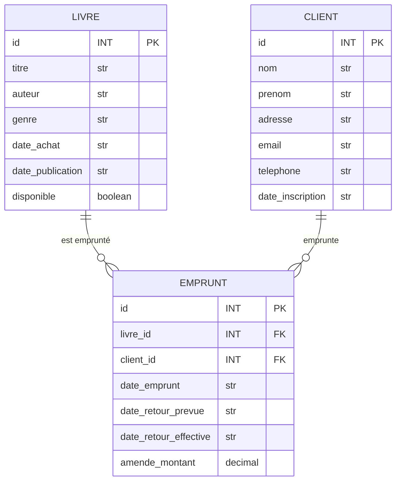
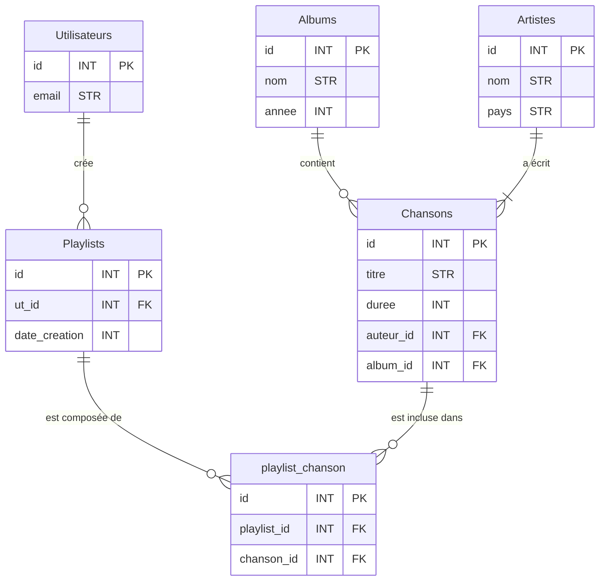
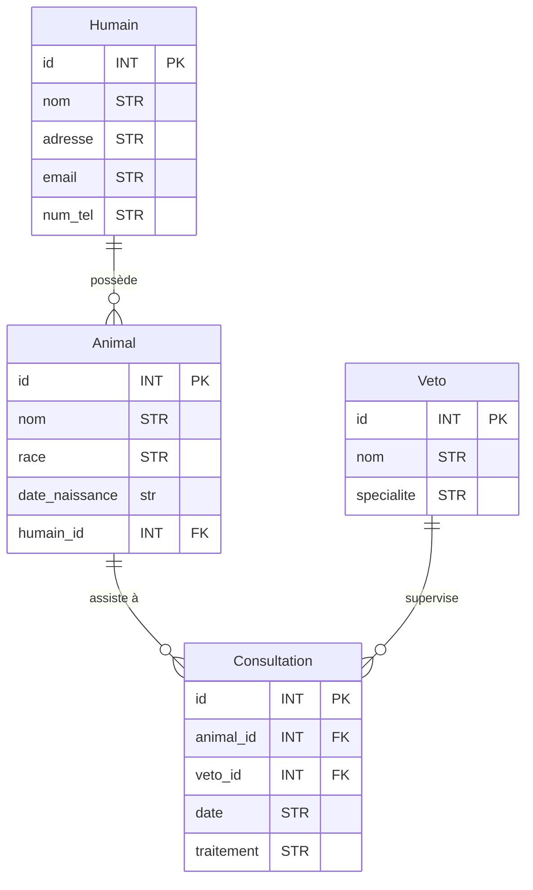
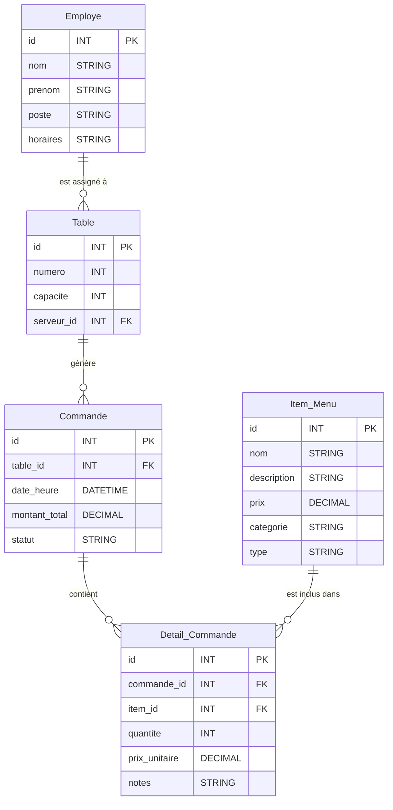

### Bibliothèque


```mermaid
erDiagram
    LIVRE {
        id INT PK
        titre str
        auteur str
        genre str
        date_achat str
        date_publication str
        disponible boolean
    }

    CLIENT {
        id INT PK
        nom str
        prenom str
        adresse str
        email str
        telephone str
        date_inscription str
    }

EMPRUNT {
        id INT PK
        livre_id INT FK
        client_id INT FK
        date_emprunt str
        date_retour_prevue str
        date_retour_effective str
        amende_montant decimal
    }
    LIVRE ||--o{ EMPRUNT : "est emprunté"
    CLIENT ||--o{ EMPRUNT : "emprunte"

```
```m̀ermaid

```
### Spotify


```mermaid
erDiagram
    Chansons {
        id INT PK
        titre STR
        duree INT
        auteur_id INT FK
        album_id INT FK
    }
    Artistes {
        id INT PK
        nom STR
        pays STR
    }
    Albums {
        id INT PK
        nom STR
        annee INT
    }
    Utilisateurs {
        id INT PK
        email STR
    }
    Playlists {
        id INT PK
        ut_id INT FK
        date_creation INT
    }
    playlist_chanson {
        id INT PK
        playlist_id INT FK
        chanson_id INT FK
    }
    Albums ||--o{ Chansons: "contient"
    Artistes ||--|{ Chansons: "a écrit"
    Utilisateurs ||--o{ Playlists: "crée"
    Playlists ||--o{ playlist_chanson: "est composée de"
    Chansons ||--o{ playlist_chanson: "est incluse dans"
```


### Vétérinaire

```mermaid
erDiagram
Animal{
id INT PK
nom STR
race STR
date_naissance str
humain_id INT FK
}
Humain{
id INT PK
nom STR
adresse STR
email STR
num_tel STR
}
Veto{
id INT PK
nom STR
specialite STR
}
Consultation{
id INT PK
animal_id INT FK
veto_id INT FK
date STR
traitement STR
}
Humain||--o{Animal: "possède"
Animal||--o{Consultation: "assiste à"
Veto||--o{Consultation: "supervise"


```
### Restaurant


```mermaid
erDiagram
    Table {
        id INT PK
        numero INT
        capacite INT
        serveur_id INT FK
    }
    
    Employe {
        id INT PK
        nom STRING
        prenom STRING
        poste STRING
        horaires STRING
    }
    
    Item_Menu {
        id INT PK
        nom STRING
        description STRING
        prix DECIMAL
        categorie STRING
        type STRING
    }
    
    Commande {
        id INT PK
        table_id INT FK
        date_heure DATETIME
        montant_total DECIMAL
        statut STRING
    }
    
    Detail_Commande {
        id INT PK
        commande_id INT FK
        item_id INT FK
        quantite INT
        prix_unitaire DECIMAL
        notes STRING
    }
    
    Employe ||--o{ Table : "est assigné à"
    Table ||--o{ Commande : "génère"
    Commande ||--o{ Detail_Commande : "contient"
    Item_Menu ||--o{ Detail_Commande : "est inclus dans"
```

