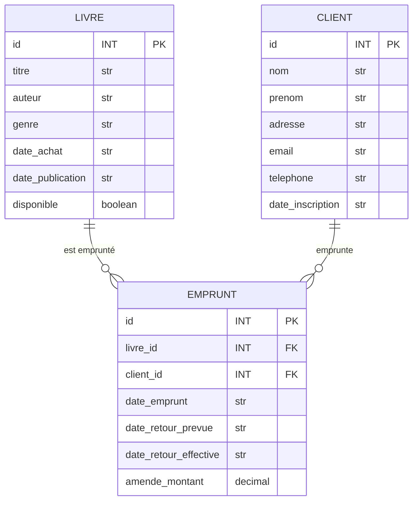

### 1. Bibliothèque municipale

On considère une bibliothèque municipale qui souhaite informatiser son système de gestion de prêts de livres.

Un livre est caractérisé par un identifiant unique, un titre, le nom de l'auteur, le genre littéraire, la date d'achat par la bibliothèque et la date de publication. Chaque livre possède également un attribut qui indique sa disponibilité (disponible ou non).

La bibliothèque gère une base de clients. Pour chaque client, on enregistre un identifiant unique, son nom, son prénom, son adresse, son adresse email, son numéro de téléphone et sa date d'inscription à la bibliothèque.

Le système doit permettre de gérer les emprunts de livres. Un emprunt est identifié par un identifiant unique et associe un livre à un client à une date donnée (date d'emprunt). Pour chaque emprunt, on enregistre également la date de retour prévue (trois semaines après la date d'emprunt), la date de retour effective (lorsque le livre est rendu) et le montant éventuel d'une amende en cas de retard (calculé à raison de 0,50€ par jour de retard).

Un livre peut être emprunté plusieurs fois au cours du temps par différents clients, mais ne peut être emprunté par plus d'un client à la fois. Un client peut emprunter plusieurs livres simultanément.

Lorsqu'un livre est emprunté, son statut "disponible" passe à faux. Lorsqu'il est retourné, son statut repasse à vrai.

### 2. Plateforme de streaming musical

On considère une plateforme de streaming musical. Une chanson est caractérisée par un titre, une durée et une date de sortie. Chaque artiste a un nom, un pays d'origine et un genre musical principal. Un album contient plusieurs chansons et possède un titre et une année de sortie. Les utilisateurs de la plateforme ont un nom, un email et un type d'abonnement (gratuit ou premium). Un utilisateur peut créer des playlists personnalisées regroupant différentes chansons.

### 3. Clinique vétérinaire

On considère une clinique vétérinaire. Un animal est identifié par son nom, son espèce, sa race et sa date de naissance. Chaque propriétaire est enregistré avec son nom, son prénom, son adresse et son numéro de téléphone. La clinique emploie plusieurs vétérinaires, caractérisés par leur nom, leur spécialité et leurs horaires de travail. Lorsqu'une consultation a lieu, on note la date, le motif, le diagnostic et le traitement prescrit. Un propriétaire peut avoir plusieurs animaux.

### 4. Restaurant

On considère un restaurant qui souhaite informatiser sa gestion des commandes, des tables et du service.

Le restaurant est organisé en tables, chacune identifiée par un numéro unique et caractérisée par sa capacité d'accueil (nombre de places). À chaque service, on assigne un serveur spécifique à une ou plusieurs tables.

Le personnel du restaurant est enregistré dans le système. Pour chaque employé, on conserve son nom, son prénom, son poste (serveur, etc.) et ses horaires de travail. Un serveur peut être responsable de plusieurs tables simultanément.

Le menu du restaurant se compose de différents items, divisés en deux catégories principales : les plats et les boissons. Chaque item possède un nom, une description, un prix et une catégorie spécifique (entrée, plat principal, dessert pour les plats ; alcool, sans alcool pour les boissons).

Lorsque des clients occupent une table, une commande est créée dans le système. Chaque commande est associée à une table spécifique et enregistre la date et l'heure, le montant total, ainsi que son statut (en cours, servie, payée).

Une commande est composée de plusieurs détails de commande, chacun représentant un item spécifique commandé avec sa quantité, son prix unitaire et d'éventuelles notes spéciales (comme "sans sauce" ou "cuisson à point"). Cette structure permet de suivre précisément chaque élément commandé tout en conservant une vue d'ensemble de la commande.