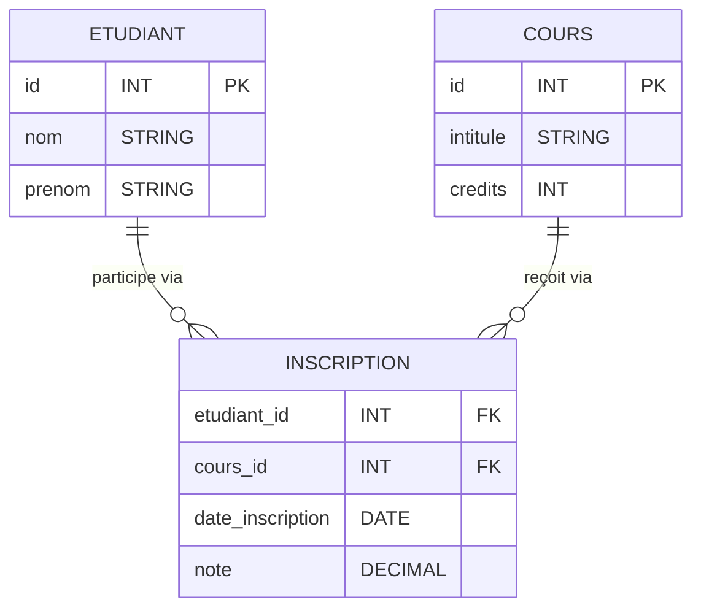
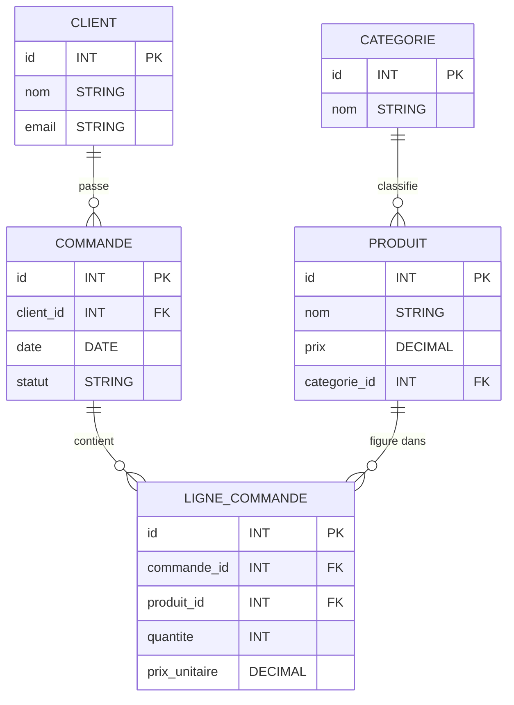

## Les Fondamentaux des Diagrammes ER

### 1. Les Composants Fondamentaux

- **Entités** : Objets ou concepts du monde réel sur lesquels on stocke des informations (ex: CLIENT, LIVRE)
- **Attributs** : Caractéristiques décrivant une entité (ex: id, nom, titre)
- **Relations** : Liens entre les entités (ex: un CLIENT emprunte un LIVRE)
- **Clés primaires** : Identifiants uniques d'une entité (souvent marqués PK)
- **Clés étrangères** : Attributs qui référencent une clé primaire d'une autre entité (marqués FK)

###  Les Différentes Cardinalités

#### Relation Un-à-Un (1:1)

**`||--||` : Un à un (obligatoire des deux côtés)**

- Signification : Une entité A est associée à exactement une entité B, et une entité B est associée à exactement une entité A.
- Exemple : `PERSONNE ||--|| PASSEPORT : "possède"`
- Explication : Une personne doit avoir exactement un passeport, et chaque passeport appartient à exactement une personne.

**`|o--|o` : Un à un (optionnel des deux côtés)**

- Signification : Une entité A peut être associée à une entité B ou à aucune, et une entité B peut être associée à une entité A ou à aucune.
- Exemple : `EMPLOYE |o--|o VEHICULE_FONCTION : "utilise"`
- Explication : Un employé peut avoir ou non un véhicule de fonction, et un véhicule peut être assigné ou non à un employé.

**`||--|o` : Un à un (obligatoire à gauche, optionnel à droite)**

- Signification : Une entité A est toujours associée à une entité B, mais une entité B peut être associée ou non à une entité A.
- Exemple : `CONDUCTEUR ||--|o VOITURE : "détient"`
- Explication : Un conducteur doit avoir une voiture pour conduire, mais une voiture peut ne pas encore être assignée à un conducteur.

### Relation Un-à-Plusieurs (1:plusieurs)

**`||--o{` : Un à plusieurs (obligatoire à gauche, zéro ou plusieurs à droite)**

- Signification : Une entité A est associée à zéro, une ou plusieurs entités B, et chaque entité B est associée à exactement une entité A.
- Exemple : `DEPARTEMENT ||--o{ EMPLOYE : "emploie"`
- Explication : Un département peut avoir plusieurs employés (ou aucun), et chaque employé appartient exactement à un département.

**`||--|{` : Un à plusieurs (obligatoire des deux côtés)**

- Signification : Une entité A est associée à une ou plusieurs entités B, et chaque entité B est associée à exactement une entité A.
- Exemple : `COMMANDE ||--|{ LIGNE_COMMANDE : "contient"`
- Explication : Une commande doit contenir au moins une ligne de commande, et chaque ligne de commande appartient à exactement une commande.

**`|o--o{` : Un à plusieurs (optionnel des deux côtés)**

- Signification : Une entité A peut être associée à zéro, une ou plusieurs entités B, et chaque entité B peut être associée ou non à une entité A.
- Exemple : `PROFESSEUR |o--o{ COURS : "peut enseigner"`
- Explication : Un professeur peut enseigner plusieurs cours ou aucun, et un cours peut être assigné ou non à un professeur.

### Relation Plusieurs-à-Plusieurs (plusieurs:plusieurs)

**`}o--o{` : Plusieurs à plusieurs (optionnel des deux côtés)**

- Signification : Une entité A peut être associée à zéro, une ou plusieurs entités B, et une entité B peut être associée à zéro, une ou plusieurs entités A.
- Exemple : `ETUDIANT }o--o{ COURS : "peut s'inscrire à"`
- Explication : Un étudiant peut s'inscrire à plusieurs cours ou à aucun, et un cours peut avoir plusieurs étudiants ou aucun.

**`}|--|{` : Plusieurs à plusieurs (obligatoire des deux côtés)**

- Signification : Une entité A est associée à une ou plusieurs entités B, et une entité B est associée à une ou plusieurs entités A.
- Exemple : `ACTEUR }|--|{ FILM : "joue dans/met en vedette"`
- Explication : Un acteur doit jouer dans au moins un film, et un film doit avoir au moins un acteur.

## Comprendre "Optionnel" vs "Obligatoire"

- **Obligatoire (`|`)** : La relation est requise. L'entité doit être associée à au moins une instance de l'autre entité.
  - Example : Dans `ENFANT ||--|| CERTIFICAT_NAISSANCE`, chaque enfant doit avoir un certificat de naissance.
- **Optionnel (`o`)** : La relation est facultative. L'entité peut exister sans être associée à l'autre entité.
  - Example : Dans `PERSONNE ||--o{ VOITURE`, une personne peut n'avoir aucune voiture.

En termes de base de données, cela se traduit souvent par des contraintes de clés étrangères pouvant être NULL (optionnel) ou NOT NULL (obligatoire).


## La Table de Jonction

Une table de jonction est nécessaire dans plusieurs cas, notamment :

1. **Pour implementer une relation plusieurs-à-plusieurs (N:M)** :
   - Exemple : Entre ETUDIANT et COURS, une table INSCRIPTION permet d'associer les étudiants aux cours qu'ils suivent
   - Structure : La table contient au minimum les clés étrangères des deux entités (étudiant_id et cours_id)

2. **Pour stocker des attributs propres à une relation** :
   - Exemple : Dans la relation entre LIVRE et CLIENT, la table EMPRUNT stocke date_emprunt, date_retour, etc.
   - Utilité : Ces informations n'appartiennent ni au livre ni au client, mais à leur relation

3. **Pour conserver l'historique des associations** :
   - Exemple : La table HISTORIQUE_EMPLOI conserve toutes les entreprises où une personne a travaillé
   - Avantage : Permet de garder trace des relations passées même si la relation actuelle est différente



## Tutoriel Mermaid pour Diagrammes ER

### Comment démarrer

Pour créer un diagramme ER avec Mermaid, commencez par le mot-clé `erDiagram` suivi de vos définitions d'entités et de relations :

```
erDiagram
    CLIENT {
        id INT PK
        nom STRING
        email STRING
    }
    COMMANDE {
        id INT PK
        client_id INT FK
        date DATE
    }
    CLIENT ||--o{ COMMANDE : "passe"
```

### Définir des entités et leurs attributs

```
erDiagram
    PRODUIT {
        id INT PK
        nom STRING
        prix DECIMAL
        stock INT
        categorie_id INT FK
    }
```

- Chaque attribut est défini sur une ligne séparée
- Le format est `nom_attribut TYPE [PK/FK]`
- Types courants : INT, STRING, DATE, DECIMAL, BOOLEAN

### Définir des relations

La syntaxe pour les relations est :
```
ENTITE1 cardinalite ENTITE2 : "label de relation"
```

Par exemple :
```
CLIENT ||--o{ COMMANDE : "passe"
```

### Exemple complet



### Où tester vos diagrammes Mermaid

1. **VS Code avec l'extension Mermaid** : Créez un fichier .md et insérez votre code Mermaid entre les délimiteurs ```mermaid```
2. **Mermaid Live Editor** : Utilisez l'éditeur en ligne à https://mermaid.live/ pour une prévisualisation instantanée
3. **GitHub** : Les fichiers README.md sur GitHub supportent nativement les diagrammes Mermaid

### Astuces pour de meilleurs diagrammes

1. **Utiliser des noms explicites** pour les entités et les relations
2. **Limiter les attributs** aux plus importants pour maintenir la clarté
3. **Organiser les entités** logiquement pour minimiser les croisements de lignes
4. **Commencer simple** et ajouter progressivement de la complexité
5. **Vérifier les cardinalités** dans les deux sens pour s'assurer qu'elles sont correctes